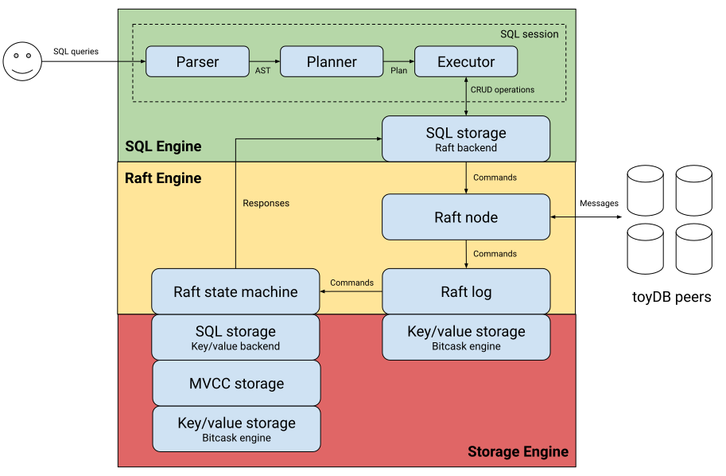

Distributed SQL database in Rust, built from scratch as an educational project. Main features:

- [Raft distributed consensus][raft] for linearizable state machine replication.

- [ACID transactions][txn] with MVCC-based snapshot isolation.

- [Pluggable storage engine][storage] with [BitCask][bitcask] and [in-memory][memory] backends.

- [Iterator-based query engine][query] with [heuristic optimization][optimizer] and time-travel
  support.

- [SQL interface][sql] including joins, aggregates, and transactions.

toyDB is intended to be simple and understandable, and also functional and correct. Other aspects
like performance, scalability, and availability are non-goals -- these are major sources of
complexity in production-grade databases, and obscure the basic underlying concepts. Shortcuts have
been taken where possible.

I originally wrote toyDB in 2020 to learn more about database internals. Since then, I've spent
several years building real distributed SQL databases at
[CockroachDB](https://github.com/cockroachdb/cockroach) and
[Neon](https://github.com/neondatabase/neon). Based on this experience, I've rewritten toyDB as a
simple illustration of the architecture and concepts behind distributed SQL databases.

[raft]: https://github.com/erikgrinaker/toydb/blob/main/src/raft/mod.rs
[txn]: https://github.com/erikgrinaker/toydb/blob/main/src/storage/mvcc.rs
[storage]: https://github.com/erikgrinaker/toydb/blob/main/src/storage/engine.rs
[bitcask]: https://github.com/erikgrinaker/toydb/blob/main/src/storage/bitcask.rs
[memory]: https://github.com/erikgrinaker/toydb/blob/main/src/storage/memory.rs
[query]: https://github.com/erikgrinaker/toydb/blob/main/src/sql/execution/executor.rs
[optimizer]: https://github.com/erikgrinaker/toydb/blob/main/src/sql/planner/optimizer.rs
[sql]: https://github.com/erikgrinaker/toydb/blob/main/src/sql/parser/parser.rs

## Documentation

- [Architecture guide](docs/architecture/index.md): a guided tour of toyDB's code and architecture.

- [SQL examples](docs/examples.md): walkthrough of toyDB's SQL features.

- [SQL reference](docs/sql.md): reference documentation for toyDB's SQL dialect.

- [References](docs/references.md): research materials used while building toyDB.

A command-line client can be built and used with node 1 on `localhost:9601`:

```
$ cargo run --release --bin toysql
Connected to toyDB node n1. Enter !help for instructions.
toydb> CREATE TABLE movies (id INTEGER PRIMARY KEY, title VARCHAR NOT NULL);
toydb> INSERT INTO movies VALUES (1, 'Sicario'), (2, 'Stalker'), (3, 'Her');
toydb> SELECT * FROM movies;
1, 'Sicario'
2, 'Stalker'
3, 'Her'
```

toyDB supports most common SQL features, including joins, aggregates, and transactions. Below is an
`EXPLAIN` query plan of a more complex query (fetches all movies from studios that have released any
movie with an IMDb rating of 8 or more):

```
toydb> EXPLAIN SELECT m.title, g.name AS genre, s.name AS studio, m.rating
  FROM movies m JOIN genres g ON m.genre_id = g.id,
    studios s JOIN movies good ON good.studio_id = s.id AND good.rating >= 8
  WHERE m.studio_id = s.id
  GROUP BY m.title, g.name, s.name, m.rating, m.released
  ORDER BY m.rating DESC, m.released ASC, m.title ASC;

Remap: m.title, genre, studio, m.rating (dropped: m.released)
└─ Order: m.rating desc, m.released asc, m.title asc
   └─ Projection: m.title, g.name as genre, s.name as studio, m.rating, m.released
      └─ Aggregate: m.title, g.name, s.name, m.rating, m.released
         └─ HashJoin: inner on m.studio_id = s.id
            ├─ HashJoin: inner on m.genre_id = g.id
            │  ├─ Scan: movies as m
            │  └─ Scan: genres as g
            └─ HashJoin: inner on s.id = good.studio_id
               ├─ Scan: studios as s
               └─ Scan: movies as good (good.rating > 8 OR good.rating = 8)
```

## Architecture

toyDB's architecture is fairly typical for a distributed SQL database: a transactional
key/value store managed by a Raft cluster with a SQL query engine on top. See the
[architecture guide](./docs/architecture/index.md) for more details.

[](./docs/architecture/index.md)

## Tests

toyDB mainly uses [Goldenscripts](https://github.com/erikgrinaker/goldenscript) for tests. These
script various scenarios, capture events and output, and later assert that the behavior remains the
same. See e.g.:

- [Raft cluster tests](https://github.com/erikgrinaker/toydb/tree/main/src/raft/testscripts/node)
- [MVCC transaction tests](https://github.com/erikgrinaker/toydb/tree/main/src/storage/testscripts/mvcc)
- [SQL execution tests](https://github.com/erikgrinaker/toydb/tree/main/src/sql/testscripts)
- [End-to-end tests](https://github.com/erikgrinaker/toydb/tree/main/tests/scripts)

Run tests with `cargo test`, or have a look at the latest
[CI run](https://github.com/erikgrinaker/toydb/actions/workflows/ci.yml).
