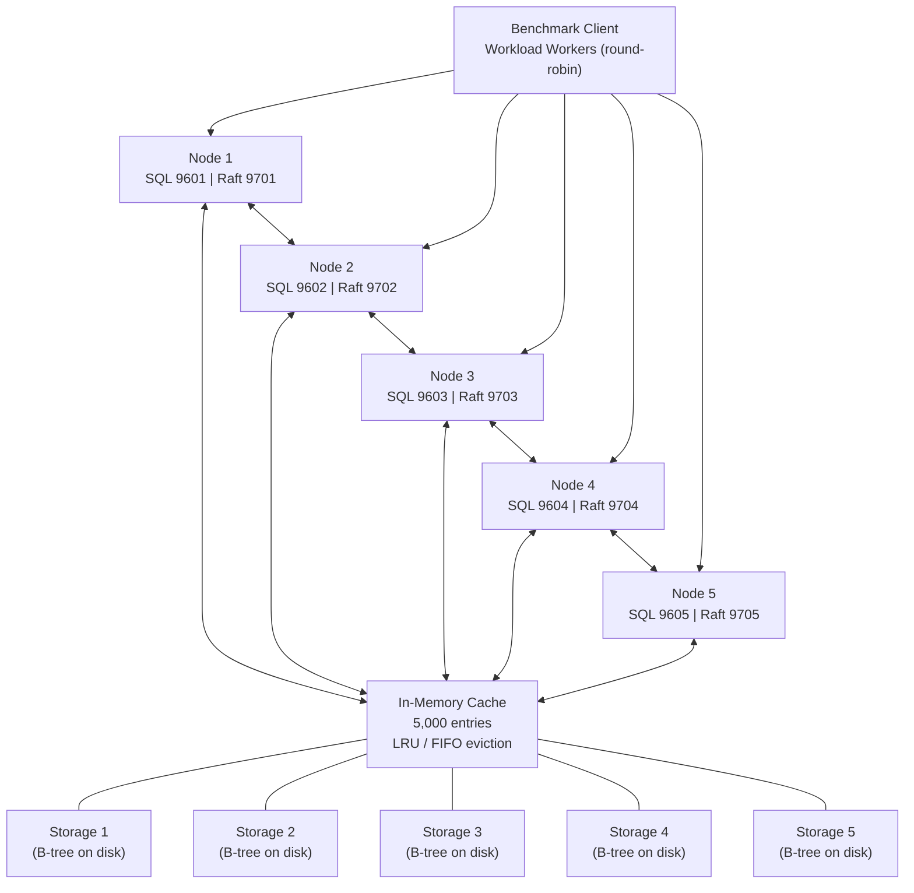
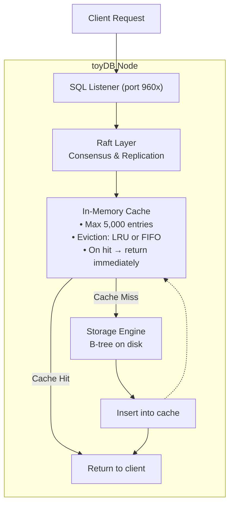
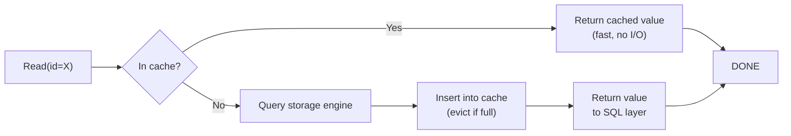
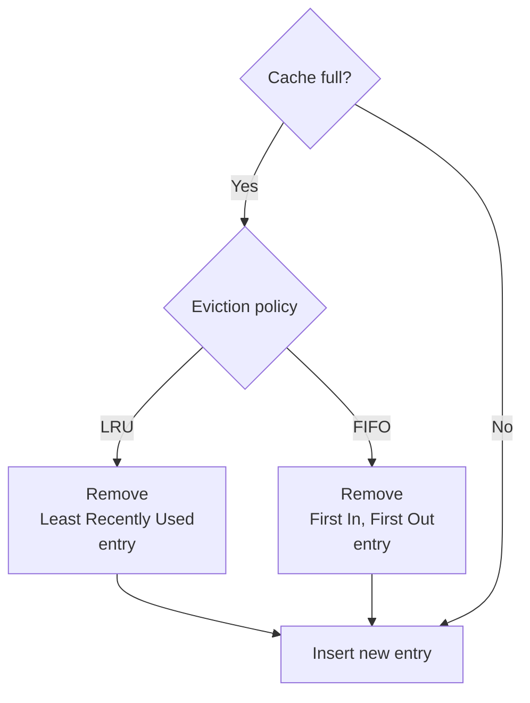

# Cache Architecture

## 5-Node Cluster — Cache in the Middle

Each node owns one cache instance. On a cache miss, the node queries its local storage engine, then populates the cache for subsequent requests.

## Per-Node Query Path

## Cache Flow

## Cache Eviction Policies

## Key Design Points

| Aspect | Detail |
|--------|--------|
| **Cache location** | In-process, each node maintains its own cache (no distributed cache) |
| **Cache capacity** | 5,000 entries |
| **Eviction policies** | LRU (default) or FIFO, configured via `--fifo` flag |
| **On miss** | Value is read from the B-tree storage, inserted into cache, then returned |
| **Concurrent access** | Workers connect round-robin across all 5 nodes; the per-node cache is shared across all connections to that node |
| **Read-only workload** | All benchmark operations are reads; writes only occur during the initial data load |
