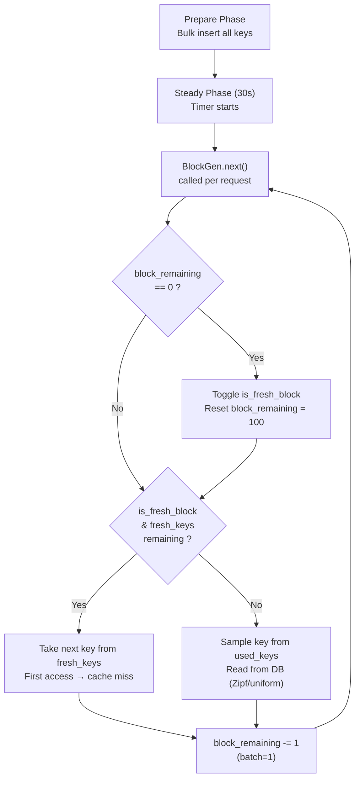

# Workload Generation Flow



## Timeline (s = 1,000 keys, block_size = 100)

```
Block   1 (fresh): keys   1..100   → first access (cache miss)
Block   2 (used):  from   100 keys → read
Block   3 (fresh): keys 101..200   → first access (cache miss)
Block   4 (used):  from   200 keys → read
...
Block  19 (fresh): keys 901..1000  → first access (cache miss)
Block  20 (used):  from  1000 keys → read
Block  21 (fresh): fallback (no fresh_keys left), sample from used_keys
Block  22 (used):  sample from used_keys
...pure reads for the rest of the 30s
```

## Key Parameters

| Parameter | s | l |
|-----------|---|---|
| Total keys | 1,000 | 10,000 |
| Block size | 100 | 100 |
| Fresh → used toggle | every 100 requests | every 100 requests |
| Fresh keys exhausted | after block 20 | after block 200 |
| After exhaustion | pure reads (Zipf/uniform) | pure reads |

## Notes

- Data is fully inserted during **Prepare** — fresh keys are not inserted into the DB during the benchmark, they are simply read for the first time, causing a cache miss.
- `BlockGen` is an **infinite iterator** — it never terminates. The benchmark stops after 30 seconds (`--duration 30`).
