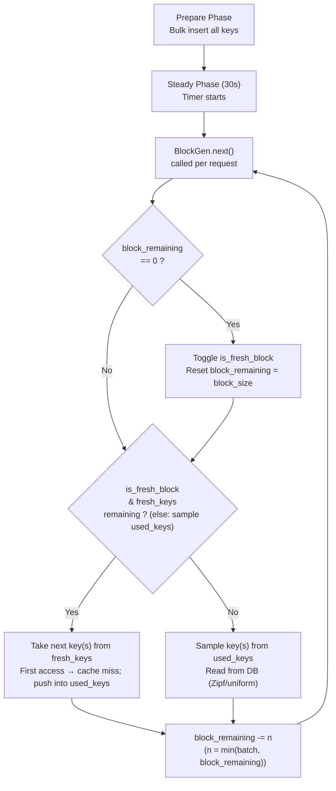

# Workload Generation Flow



## Timeline (s = 1,000 keys, block_size = 100, batch = 1)

```
Block   1 (fresh): keys   1..100   → first access (cache miss)
Block   2 (used):  sample from the 100 used keys → read
Block   3 (fresh): keys 101..200   → first access (cache miss)
Block   4 (used):  sample from the 200 used keys → read
...
Block  19 (fresh): keys 901..1000  → first access (cache miss)
Block  20 (used):  sample from the 1000 used keys → read
Block  21 (fresh): fallback (no fresh_keys left), sample from used_keys
Block  22 (used):  sample from used_keys
...pure reads for the rest of the 30s
```

## Key Parameters

| Parameter | s | l |
|-----------|---|---|
| Total keys | 1,000 | 10,000 |
| Block size | 100 | 100 |
| Fresh → used toggle | every 100 requests (blocks of size 100) | every 100 requests |
| Fresh keys exhausted | after block 20 | after block 200 |
| After exhaustion | pure reads (Zipf/uniform) | pure reads |

## Notes

- Data is fully inserted during **Prepare** — the table is populated before the timed steady phase. Fresh keys are observed for the first time during the benchmark and cause cache misses on first access.
- `BlockGen` is an **infinite iterator** that yields HashSet<u64> batches. Each call to next() selects up to `batch` keys (n = min(batch, block_remaining)).
- When in a fresh block, keys are taken sequentially from a shuffled `fresh_keys` list and appended to `used_keys` as they are emitted. If `fresh_keys` is exhausted while in a fresh block, the generator falls back to sampling from `used_keys`.
- When in a used block, keys are sampled from `used_keys` (which grows as fresh keys are emitted).
- Sampling uses a Zipf distribution when `--dist zipf` is selected (and the sample space length > 1); otherwise keys are sampled uniformly at random.
- The block_remaining counter is decreased by the number of keys emitted in that next() call (n), not always by 1 — this accounts for batch sizes > 1.
- The implementation assumes `used_keys` is non-empty before sampling from it (i.e., there are previously emitted fresh keys); in normal runs this holds because the workload starts with a fresh block that populates `used_keys`.
- The benchmark stops after the configured duration (e.g., `--duration 30`).
