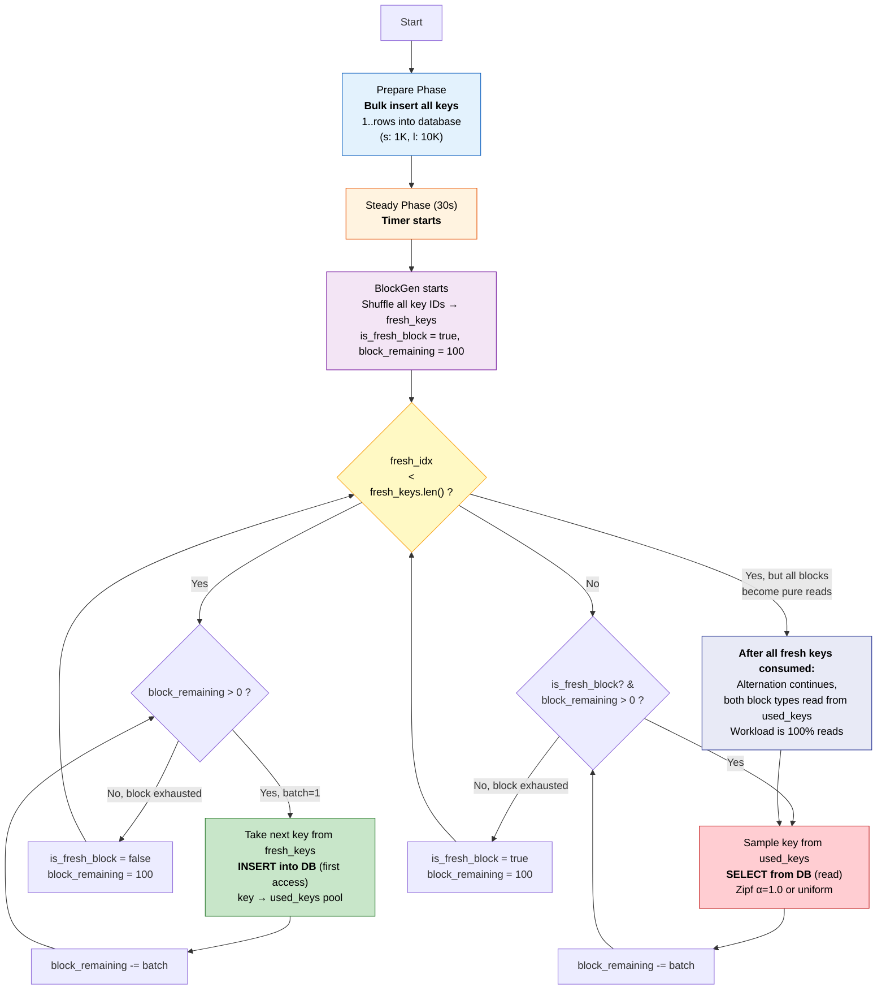

# Workload Generation Flow



## Block Timeline Example (s = 1000 keys)

```
Block   1 [fresh]: keys 1..100     → INSERT (cache miss)
Block   2 [used]:  sample from 100  → SELECT
Block   3 [fresh]: keys 101..200   → INSERT (cache miss)
Block   4 [used]:  sample from 200  → SELECT
...
Block  19 [fresh]: keys 901..1000  → INSERT (cache miss)
Block  20 [used]:  sample from 1000 → SELECT
Block  21 [fresh]: fallback → sample from 1000 → SELECT
Block  22 [used]:  sample from 1000 → SELECT
...
```

- `block_size = 100`, `batch = 1` → mỗi block = 100 requests
- 1000 keys / 100 = 10 fresh blocks để consume hết fresh_keys
- Sau block 20, tất cả là pure reads (cả fresh lẫn used block đều sample từ used_keys)
- Mỗi request = 1 key (batch=1)

## Key Parameters

| Parameter | Value | Description |
|-----------|-------|-------------|
| `--rows` | 1000 (s) / 10000 (l) | Total keys |
| `--block-size` | 100 | Requests per block |
| `--batch` | 1 | Keys per request |
| `--dist` | uniform / zipf | Sampling distribution |
| `--zipf-skew` | 1.0 | Zipf skew parameter |
| `--duration` | 30 | Benchmark duration (seconds) |
